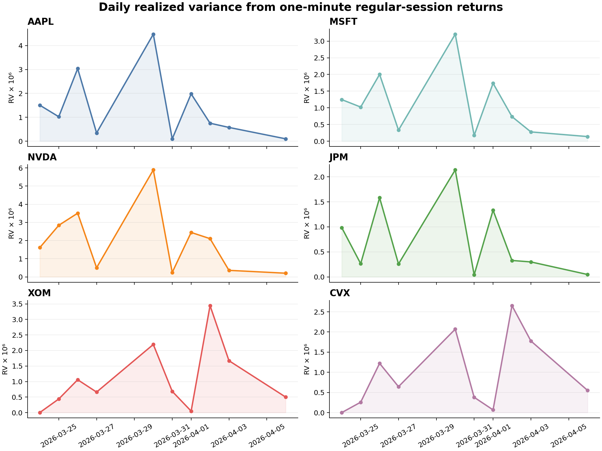
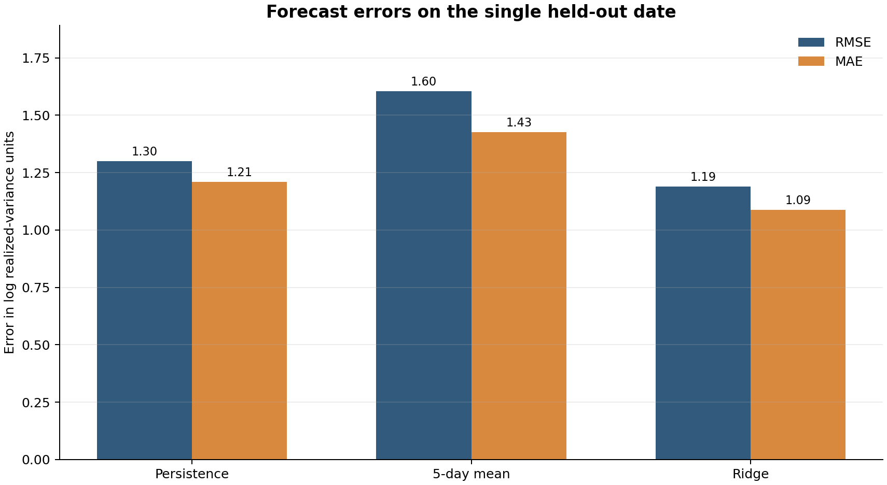
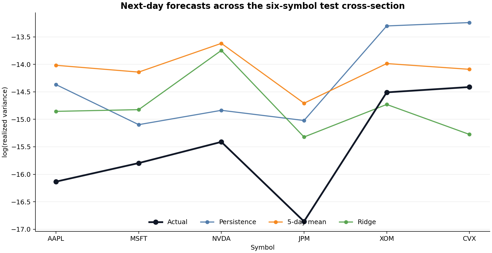

# Forecasting Tomorrow's Realized Variance from One-Minute Bars

A volatility forecast can fail before the model ever sees the data. One timestamp assigned to the wrong session, one rolling window that reaches into tomorrow, or one random train-test split can make an ordinary regression look prescient.

I built this project around a narrower question: can information available after today's close forecast tomorrow's realized variance better than two naive rules? The entire experiment runs offline from tracked parquet files. That makes the data path inspectable, which matters more here than adding another model.

The payload contains 23,400 one-minute bars for AAPL, MSFT, NVDA, JPM, XOM, and CVX. It covers ten regular trading sessions from March 24 through April 6, 2026. This is enough to exercise the research pipeline. It is nowhere near enough to settle which forecast should be traded.

## From minute prices to a daily target

For symbol $i$, trading date $d$, and intraday bar $t$, let $P_{i,d,t}$ denote the observed price. The one-minute log return $r_{i,d,t}$ is the natural logarithm of the ratio between consecutive prices:

$$
r_{i,d,t}
= \log\left(\frac{P_{i,d,t}}{P_{i,d,t-1}}\right).
$$

Daily realized variance $RV_{i,d}$ is the sum of those squared returns within the regular session:

$$
RV_{i,d}
= \sum_{t=1}^{T_d} r_{i,d,t}^{2},
$$

where $T_d$ is the number of usable intraday returns on date $d$. Each tracked session has 390 price bars from 09:30 through 15:59 New York time, so it produces 389 returns. All 60 symbol-day observations in the sample meet that count.

The implementation first converts Coordinated Universal Time timestamps to `America/New_York`, assigns the exchange-local date, and then computes returns inside each symbol-date group. Grouping before shifting is the small detail that prevents an overnight move from entering the intraday measure.

```python
group_columns = ["symbol", "date"]
prepared_bars["log_return"] = prepared_bars.groupby(group_columns)["price"].transform(
    lambda values: np.log(values / values.shift(1))
)

realized_daily = prepared_bars.groupby(group_columns, as_index=False).agg(
    realized_variance=("log_return", _sum_squared_log_returns),
    bar_count=("log_return", _non_missing_log_return_count),
)
```



The six panels show how uneven the measured variance is even in ten sessions. NVDA reaches the largest observation, about $5.89 \times 10^{-6}$, while the full sample minimum is about $9.45 \times 10^{-10}$. Modeling the natural logarithm of variance compresses that scale difference and prevents the highest-variance day from dominating a squared-error fit in levels.

## The alignment that keeps tomorrow out of today's features

Let $\mathbf{x}_{i,d}$ be the feature vector known after the close on date $d$. The forecast target $y_{i,d+1}$ is next-session log realized variance:

$$
y_{i,d+1}=\log(RV_{i,d+1}),
\qquad
\widehat{y}_{i,d+1}=f(\mathbf{x}_{i,d}),
$$

where $f$ is the forecasting rule and $\widehat{y}_{i,d+1}$ is its prediction. The feature vector contains five quantities:

- same-day log realized variance;
- the five-day mean and five-day standard deviation of log realized variance;
- the absolute change from the previous day's log realized variance;
- the fraction of the expected 389 returns present in the session.

The source calls the first field `lag_1_log_rv`. Its economic meaning is clearer than its name: realized variance for day $d$ is known after that session closes and is used to forecast day $d+1$. The grouped negative shift creates the target. No predictor is shifted forward.

```python
frame["lag_1_log_rv"] = frame["log_rv"]
frame["lag_5_mean_log_rv"] = frame.groupby("symbol")["log_rv"].transform(
    lambda values: values.rolling(5).mean()
)
frame["target_date"] = frame.groupby("symbol")["date"].shift(-1)
frame["target_log_rv_next_day"] = frame.groupby("symbol")["log_rv"].shift(-1)
```

The five-day rolling fields consume the first four sessions. That leaves five feature dates and 30 aligned symbol-date rows. The walk-forward routine uses the first four dates for training and the fifth, April 3, for testing against realized variance on April 6. In other words, the reported evaluation contains one date and six stocks.

## Three forecasts, one honest time split

The persistence forecast sets tomorrow's log variance equal to today's. The rolling-mean forecast uses the five-day average. Ridge regression combines all five standardized features.

For $n$ training observations, let $y_j$ be the observed next-day log variance, $\mathbf{x}_j$ the standardized feature vector, $\beta_0$ the intercept, $\boldsymbol{\beta}$ the coefficient vector, and $\lambda$ the non-negative penalty strength. Ridge estimates the coefficients by solving

$$
(\widehat{\beta}_0,\widehat{\boldsymbol{\beta}})
= \arg\min_{\beta_0,\boldsymbol{\beta}}
\left[
\sum_{j=1}^{n}
\left(y_j-\beta_0-\mathbf{x}_j^{\mathsf T}\boldsymbol{\beta}\right)^2
+\lambda\sum_{k=1}^{5}\beta_k^2
\right].
$$

The first sum is training squared error. The second shrinks the five slope coefficients toward zero. The project sets $\lambda=1$. At each walk-forward step, feature means and standard deviations come only from earlier dates. Applying full-sample scaling before the split would leak the test distribution into training.

The evaluation uses root mean squared error (RMSE), mean absolute error (MAE), and out-of-sample coefficient of determination, written $R^2_{\mathrm{oos}}$. For $m$ forecasts, actual values $y_j$, predictions $\widehat y_j$, and evaluation-sample mean $\bar y$, the calculations are

$$
\mathrm{RMSE}
=\sqrt{\frac{1}{m}\sum_{j=1}^{m}(y_j-\widehat y_j)^2},
\qquad
\mathrm{MAE}
=\frac{1}{m}\sum_{j=1}^{m}|y_j-\widehat y_j|,
$$

$$
R^2_{\mathrm{oos}}
=1-
\frac{\sum_{j=1}^{m}(y_j-\widehat y_j)^2}
{\sum_{j=1}^{m}(y_j-\bar y)^2}.
$$

Lower RMSE and MAE are better. A negative $R^2_{\mathrm{oos}}$ means the forecasts have more squared error than assigning the same evaluation-sample mean to every observation.

## What happened on the held-out date

| Model | RMSE | MAE | $R^2_{\mathrm{oos}}$ |
|---|---:|---:|---:|
| Persistence | 1.300 | 1.209 | -1.253 |
| Five-day mean | 1.604 | 1.427 | -2.429 |
| Ridge | 1.190 | 1.089 | -0.888 |



Ridge has the smallest error on this date. Its RMSE is 8.45 percent below persistence, while the five-day mean performs worst. Every $R^2_{\mathrm{oos}}$ is negative. The result therefore says something modest: the regularized regression lost less badly to the cross-sectional mean benchmark than the two naive forecasts did.



The cross-section shows the misses hidden by one aggregate number. Actual log variance on April 6 ranges from -16.86 for JPM to -14.41 for CVX. Ridge follows some relative differences, especially NVDA versus JPM, but it overpredicts variance for every symbol. Persistence is closer for the energy names and too high for several others. With one date, those patterns may be a single regime rather than repeatable behavior.

The coefficient file carries another useful diagnostic. `bar_completeness` is exactly 1 for every observation, so its standardized value and fitted coefficient are zero. A data-quality field can be useful in production and still contain no information in a clean demo sample.

## What I would require before trusting the ranking

The current run validates plumbing: local-session assignment, return construction, rolling alignment, train-only scaling, model fitting, and artifact generation all work from a clone without a live database. It does not validate a forecasting edge.

A credible comparison needs many more test dates across calm and stressed markets. I would keep each day's six-symbol cross-section together during splitting, report metrics by date and symbol, and attach uncertainty to the difference between ridge and persistence. The universe also needs broader sector coverage. Six large US stocks can share market-wide volatility shocks, so treating all 30 training rows as independent exaggerates the effective sample size.

The target itself has boundaries. It excludes overnight returns and uses one-minute prices without correcting for microstructure noise. A longer study should compare sampling intervals, inspect jumps, and decide whether the intended risk decision concerns the cash session, the full close-to-close day, or both.

That is the useful outcome of this small experiment. The model ranking is provisional. The pipeline makes the next, larger experiment hard to fool.
